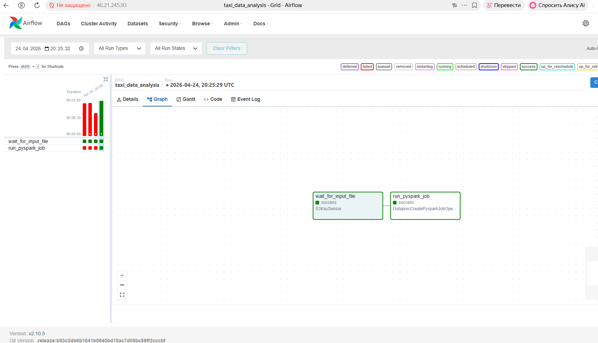
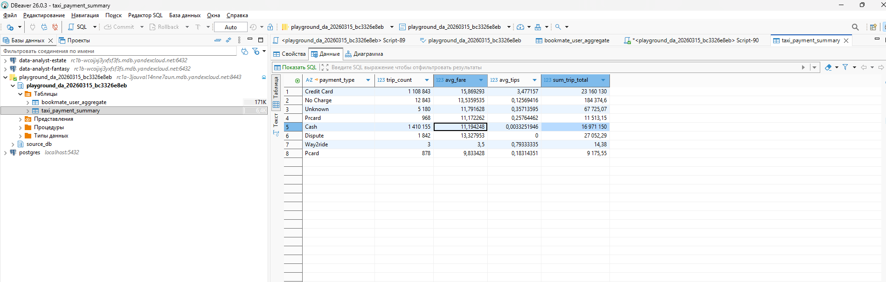

# ETL-пайплайн для агрегации данных о поездках Яндекс Такси по способам оплаты.

## Стек
- Apache Airflow (оркестрация)
- PySpark (обработка данных)
- ClickHouse (хранилище)
- Yandex Object Storage / S3 (источник данных)

## Как запустить
1. Скопируй `.env.example` в `.env` и заполни значения
2. Положи `spark_job.py` в S3: `s3a://bucket/username/jobs/`
3. Добавь DAG `dag_taxi.py` в папку Airflow DAGs
4. Настрой Connections в Airflow UI: `clickhouse_default`, `s3`
5. Запусти DAG `taxi_data_analysis`

## Что делает пайплайн
1. `S3KeySensor` ждёт появления файла с данными в S3
2. `DataprocCreatePysparkJobOperator` запускает Spark-задание
3. Spark читает Parquet, агрегирует по `payment_type`, пишет в ClickHouse

## Результаты

### DAG успешно выполнен в Airflow

### Результат в ClickHouse / DBeaver

