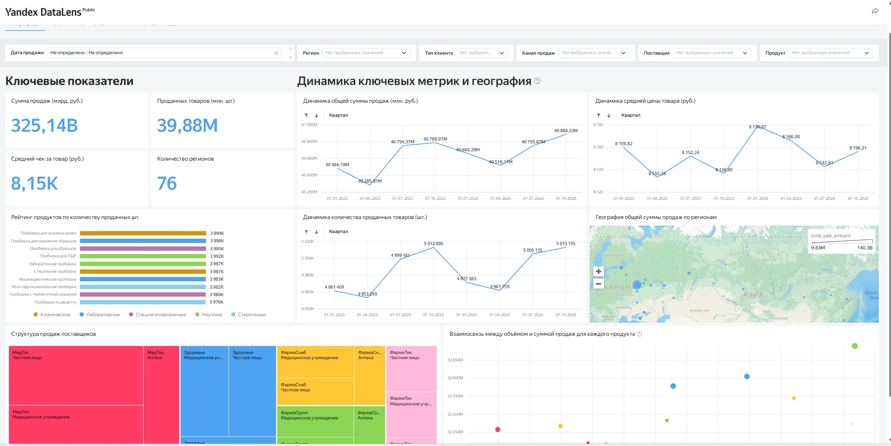
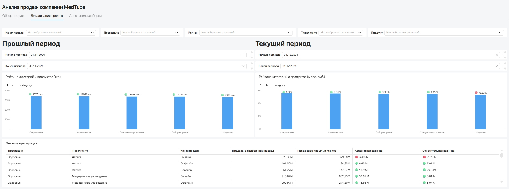
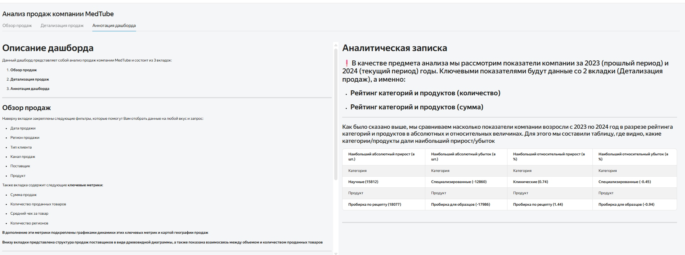

# Многостраничный дашборд: B2B-продажи медицинского оборудования 

 **[Посмотреть интерактивный дашборд в Yandex DataLens](https://datalens.yandex/m23n31z2tbtq7)**

##  Паспорт дашборда 

| Атрибут | Описание |
| :--- | :--- |
| **Бизнес-цель** | Помочь отделу продаж отслеживать ключевые метрики реализации медицинских пробирок |
| **Заказчик** | Директор отдела B2B-продаж |
| **Аудитория** | Директор отдела, линейные менеджеры отдела продаж |
| **Инструмент** | Yandex DataLens, БД PostgreSQL |

##  Архитектура дашборда
Проект спроектирован по принципу *Overview-to-Detail* и включает 3 логически связанные вкладки:

1. **Обзор продаж (Overview):** Оценка верхнеуровневой динамики. Включает линейные графики объема и выручки, динамику среднего чека (грануляция по кварталам) и общую географию реализации.
2. **Детализация продаж (Detail):** Глубокий анализ структуры. Содержит сравнение текущего и прошлого периодов (YoY), рейтинги продуктов, а также детальную таблицу по поставщикам и каналам с расчетом дельт.
3. **Аннотация дашборда:** Справочная информация по метрикам, описание логики расчетов и аналитическая записка с выводами.

##  Матрица метрик и система фильтрации

| Название показателя | Логика расчёта | Источник данных |
| :--- | :--- | :--- |
| **Выручка (руб.)** | Общая сумма продаж товара (`SUM(total_sale_amount)`) | PostgreSQL |
| **Объем продаж (шт.)**| Количество продаж товара (`SUM(quantity)`) | PostgreSQL |
| **Средний чек (руб.)**| Средняя стоимость товара (`AVG(sale_price)`) | Вычисляемая метрика |
| **Охват (регионы)** | Количество уникальных регионов продаж (`COUNT DISTINCT(region_name)`) | PostgreSQL |

**Глобальные фильтры (с кросс-фильтрацией):** Период (отчетный и сравнения), Регион, Тип клиента, Канал продаж, Поставщик, Категория товара.

##  Аналитическая записка
В рамках анализа проведено сравнение показателей (YoY) за 2023 и 2024 годы с фокусом на динамику реализации по категориям и продуктам.

**Ключевые инсайты:**
1. **Точки роста:** Главным драйвером продаж в 2024 году стала категория «Научные» (абсолютный прирост +15 812 шт.) и категория «Клинические» (относительный прирост выручки +74%).
2. **Флагманский продукт:** Наилучшую динамику демонстрирует «Пробирка по рецепту», показавшая рост продаж на 18 077 шт. (+144% год к году).
3. **Зоны риска:** Зафиксировано существенное падение продаж в категории «Специализированные» (убыток -12 860 шт. / -45% YoY). Худшую динамику внутри ассортиментной матрицы показал продукт «Пробирка для образцов» (падение на 17 986 шт. / -94% YoY).

**Рекомендация:** Отделу продаж необходимо пересмотреть стратегию реализации категории «Специализированные» (в частности, выявить причины падения спроса на пробирки для образцов) и масштабировать успешный опыт продвижения научных и клинических пробирок.

##  Превью дашборда

### 1. Обзор продаж
*(Динамика выручки, объема, среднего чека и геокарта)*

### 2. Детализация продаж
*(Сравнение периодов, рейтинги продуктов и таблица с расчетом дельт)*

### 3. Аннотация дашборда
*(Структура дашборда и текстовая аналитика)*

